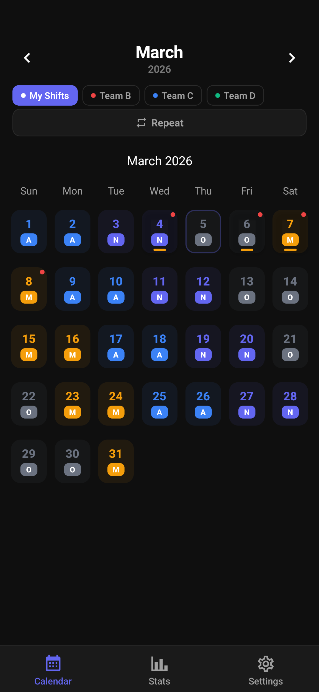
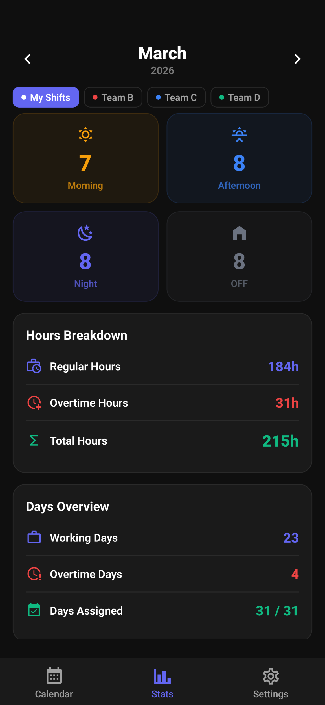
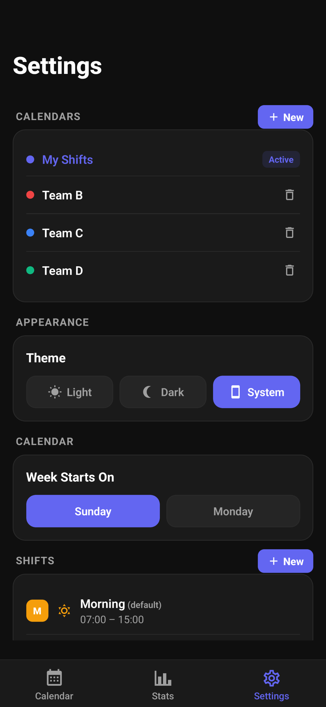

# ShiftCalendar

A modern, offline-first shift scheduling app for shift workers. Track shifts, leave, overtime, and pay on a clean monthly calendar. Built with React Native + Expo.

[](https://github.com/iTroy0/ShiftCalendar/releases/latest)

## Features

- **Monthly Calendar** -- Color-coded shift & leave badges with swipe navigation
- **Adjacent Month Days** -- See previous/next month shifts in the calendar grid
- **Quick Assign** -- Tap to assign, long-press for instant last-used shift
- **Shift Templates** -- 8 pre-built rotations (2-2-2, 4-on/4-off, Continental, Panama, DuPont, and more)
- **Repeat Patterns** -- Select a date range and repeat any shift pattern forward
- **Custom Shifts** -- Create shift types with custom names, colors, icons, and times
- **Leave Management** -- Annual, Sick, Emergency, and Unpaid leave with yearly balance tracking
- **Shift Swap** -- Offer swaps and share requests via WhatsApp, SMS, etc.
- **Pay Calculator** -- Base rate + overtime rate with monthly pay estimates
- **Multi-Calendar** -- Manage separate calendars (e.g. My Shifts, Team A, Team B)
- **Stats Dashboard** -- Monthly shift counts, hours breakdown, pay estimates, and leave balance
- **Overtime Tracking** -- Log overtime hours per day with automatic totals
- **Notes & Search** -- Add notes to any day and search through all notes
- **Android Widget** -- Home screen widget showing the current week's shifts
- **Week View** -- Toggle between month and week views
- **Yearly Overview** -- At-a-glance heatmap of the entire year
- **Dark / Light / System Theme** -- Full theme support including the widget
- **Export & Import** -- CSV export/import, PDF export, full backup/restore
- **Notifications** -- Evening reminders for the next day's shift
- **Configurable** -- Week start day, currency (33 supported), haptic feedback
- **Offline & Private** -- All data stored locally. No account, no server, no tracking.
- **Accessible** -- Screen reader labels on all interactive elements

## Screenshots

<p align="center">
  
  
  
</p>

## Getting Started

### Prerequisites

- [Node.js](https://nodejs.org/) (v18+)
- [Expo CLI](https://docs.expo.dev/get-started/installation/)

### Installation

```bash
git clone https://github.com/iTroy0/ShiftCalendar.git
cd ShiftCalendar
npm install
```

### Development

```bash
npx expo start
npx expo start --android
npx expo start --ios
```

> **Note:** The Android home screen widget requires an EAS development build, not Expo Go.

## Building

### Cloud Build (EAS)

```bash
npm install -g eas-cli
eas login

# Preview APK
eas build --platform android --profile preview

# Production AAB (for Google Play)
eas build --platform android --profile production
```

### Local Build

```bash
npx expo prebuild --platform android
cd android
./gradlew assembleRelease
```

## Project Structure

```
ShiftCalendar/
├── app/
│   ├── _layout.tsx              # Root layout with providers
│   └── (tabs)/
│       ├── index.tsx             # Calendar screen
│       ├── stats.tsx             # Stats screen
│       └── settings.tsx          # Settings screen
├── components/
│   ├── CalendarDay.tsx           # Day cell with shift/leave pills
│   ├── DaySheet.tsx              # Day detail bottom sheet
│   ├── TemplateSheet.tsx         # Template selector
│   ├── RepeatSheet.tsx           # Pattern repeat sheet
│   ├── NotesSearchSheet.tsx      # Notes search
│   ├── ShiftEditor.tsx           # Shift create/edit form
│   ├── WeekView.tsx              # Week view display
│   ├── YearlyOverview.tsx        # Yearly heatmap
│   └── settings/                 # Settings section components
├── hooks/
│   ├── ShiftContext.tsx           # Shift data context
│   ├── ThemeContext.tsx           # App settings context
│   ├── useShiftData.ts           # Data persistence layer
│   ├── useTheme.ts               # Theme & preferences
│   └── useDeepLinkHandler.ts     # File import handler
├── constants/
│   ├── shifts.ts                 # Shift type definitions
│   ├── templates.ts              # Rotation templates
│   ├── leaveTypes.ts             # Leave type definitions
│   ├── colors.ts                 # Theme color palettes
│   └── currencies.ts             # Currency list
├── utils/
│   ├── exportImport.ts           # CSV/PDF/backup export & import
│   ├── statsCalculation.ts       # Stats computation
│   └── notifications.ts          # Shift reminders
├── widgets/
│   ├── ShiftWeekWidget.tsx       # Android widget UI
│   └── widget-task-handler.tsx   # Widget data handler
└── assets/                       # App icons & splash
```

## Tech Stack

- **Framework** -- React Native + Expo SDK 55
- **Language** -- TypeScript
- **Routing** -- Expo Router (file-based)
- **Calendar** -- react-native-calendars
- **Animations** -- react-native-reanimated
- **Gestures** -- react-native-gesture-handler
- **Bottom Sheets** -- @gorhom/bottom-sheet
- **Storage** -- @react-native-async-storage/async-storage
- **Widget** -- react-native-android-widget
- **Date Math** -- date-fns
- **Haptics** -- expo-haptics

## License

MIT

## Author

Made by **Troy**
